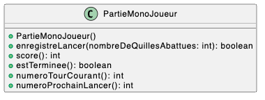

# COMPTER LES POINTS AU BOWLING

### [Voir la solution](./Solution.md)
- Une _partie_ est composée de 10 _tours_. A chaque tour, le joueur exécute 1 ou 2 lancers, et le but est d’abattre les 10 quilles.
	- Si le joueur ne parvient pas à abattre les 10 quilles en 2 lancers, le tour apporte un nombre de points égal au nombre de quilles abattues.
	- Si le joueur parvient à abattre les 10 quilles en 2 lancers, on appelle cela un _spare_ et le tour rapporte 10 points, 
          plus le nombre de quilles abattues par le lancer suivant 
          (le lancer suivant comptera alors double : 1 fois dans ce tour et une fois dans le tour suivant). 
          On peut considérer que le tour suivant apporte un bonus au tour courant, égal au nombre de quilles abattues par son premier lancer.
	- Si le joueur parvient à abattre les 10 quilles au premier lancer, il ne fait pas le deuxième lancer, et on appelle cela un _strike_ 
          et le nombre de points apporté par le tour est de 10, plus le nombre de quilles abattues par les deux lancers suivants 
          (les 2 lancers suivants compteront alors double : 1 x dans ce tour et une fois dans le (les) tour(s) suivant(s).
	- Si le joueur fait un spare au dernier tour, il a droit à une boule supplémentaire. S’il fait un strike au dernier tour, il à droit à deux boules supplémentaires. 
          Le dernier tour, contrairement aux tours précédents, peut donc comporter jusqu’à trois lancers.

### Quelques exemples

Spare :

Le joueur abat 6 quilles au premier lancer, puis abat les 4 quilles restantes. Il a donc fait un spare au premier tour. Ses points sont comptés ainsi : 1° tour : 10 points plus prochaine boule du tour suivant (5 quilles) = 15 points. S’il envoie toutes les autres quilles dans la rigole, son score final sera de 15 + 5 points.

&nbsp;

Strike :

Le joueur abat les 10 quilles du premier coup. Il a donc fait un strike. Ses points sont comptés ainsi : 1° tour : 10 points, plus la boule suivante (b1) (1° du 2° tour) 7 quilles, plus la boule d'après (b2) (2° du 2° tour) 2 quilles = 19 points. S’il envoie toutes les autres quilles dans la rigole, son score final sera de 19 + 7 + 2 points.

3 strikes de suite :

Aux 1°, 2° et 3° tours, le joueur a fait 3 strikes de suite. Il envoie ensuite toutes les boules dans la rigole. Le premier tour rapporte 10 + 10 + 10 points, le 2° tour rapporte 10 + 10 + 0 points, et le 3° tour rapporte 10 + 0 + 0 points. Le score final est donc de 60.

Si un joueur ne fait que des strikes, chacun de ses tours lui rapportera 30 points : 10 quilles + les 10 de la boule suivante, + les 10 de la boule d'après, ce qui le donnera le maximum de points possibles, soit 300 (c'est excessivement rare, même pour les joueurs du plus haut niveau).

## Travail demandé

- En vous servant de ce point de départ, concevoir et implémenter un programme java qui enregistre les résultats des lancers successifs **d'un seul joueur**, et qui permet de connaître son score. Vous pouvez (bien entendu) modifier la classe PartieMonoJoueur et rajouter autant d'autres classes que nécessaire en plus de la classe PartieMonoJoueur, qui sera votre classe principale. Consultez la documentation du projet pour les détails sur les méthodes. Le nom et la signature des méthodes publiques données ne doivent pas être modifiés.
- Tous les tests contenus dans le jeu de test doivent être conservés. Vous pouvez ajouter d’autres tests de votre invention.

### Vous serez noté sur :

- La qualité de la conception orientée-objet (décomposition en classes, attribution des responsabilités aux classes, choix des méthodes...). Vous devez fournir le diagramme de classes UML correspondant dans le dépôt github (répertoire ./doc).
- La qualité du code (choix des identificateurs, indentation, respect des règles de nommage, commentaires...)
- La complétude et la qualité des tests unitaires, qui doivent démontrer que l'implémentation est correcte
- La couverture de test