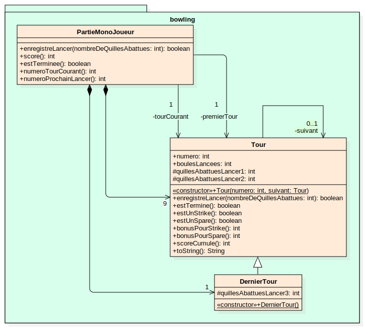
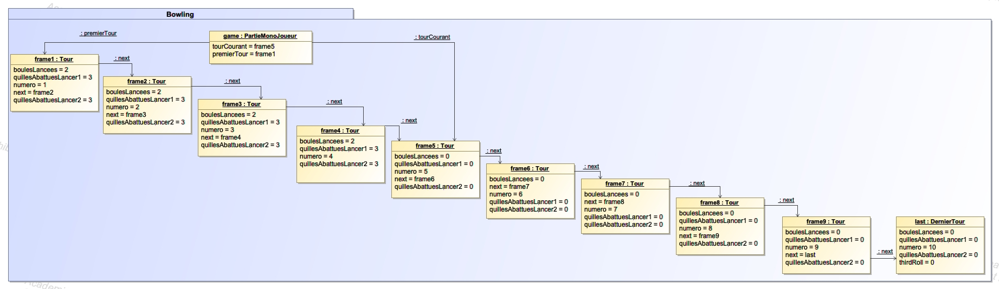

# Solution

## Diagramme de classes

- Une partie est composée de 9 tours "normaux" (avec 2 boules) et d'un "dernier tour" (avec 3 boules si le joueur a fait un spare ou un strike).
- la partie connait son premier tour, et le tour courant
- Les tours "normaux" connaissent leur tour suivant pour pouvoir leur demander un bonus en cas de strike ou de spare
- Un tour peut calculer le score cumulé à partir de ce tour.

## Diagramme d'instances

- On construit une "liste chaînée" de tours à partir du dernier, chaque tour connaissant son tour suivant.